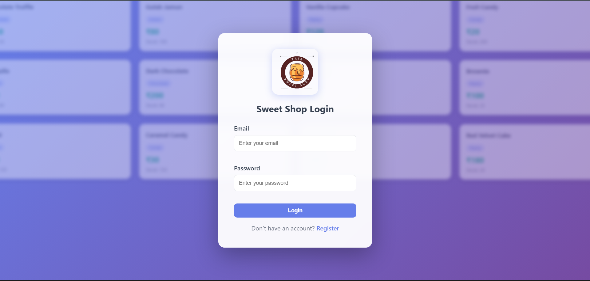
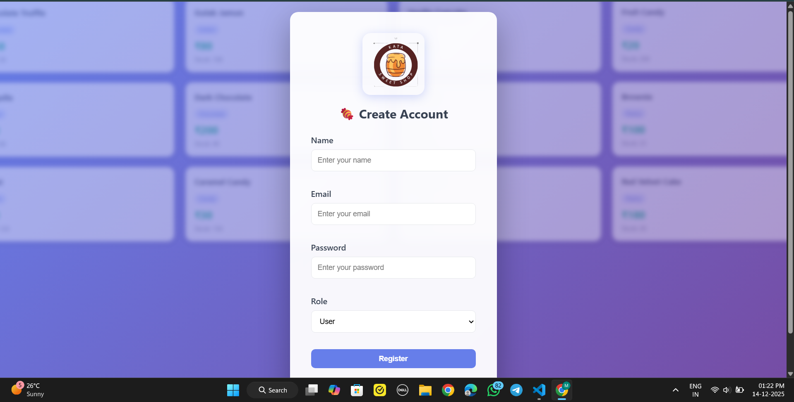
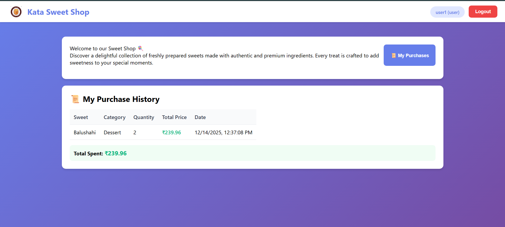
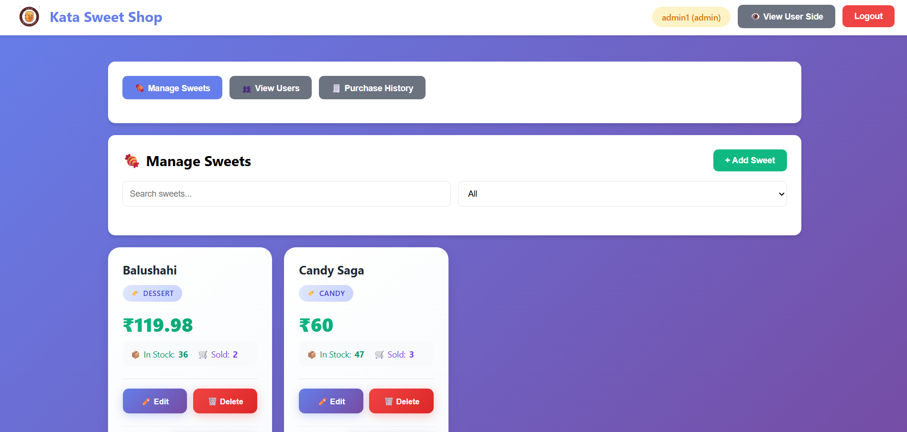
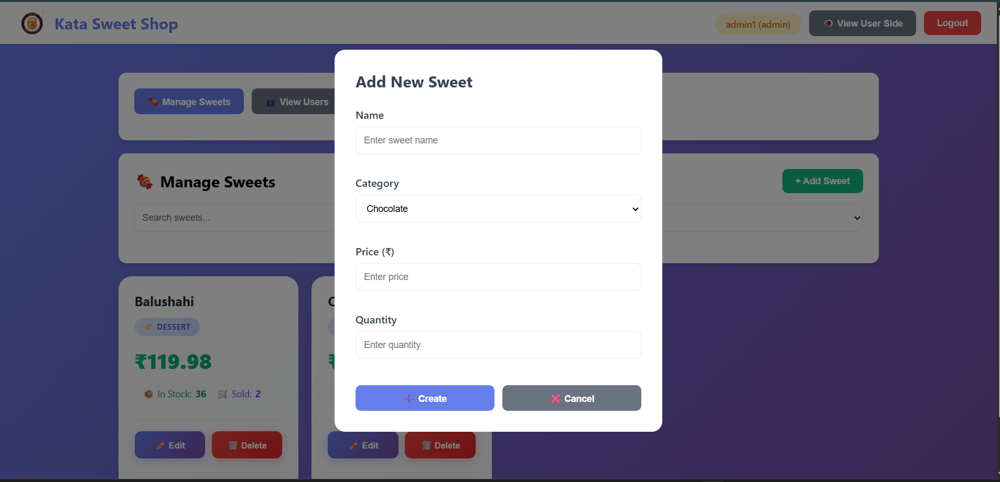
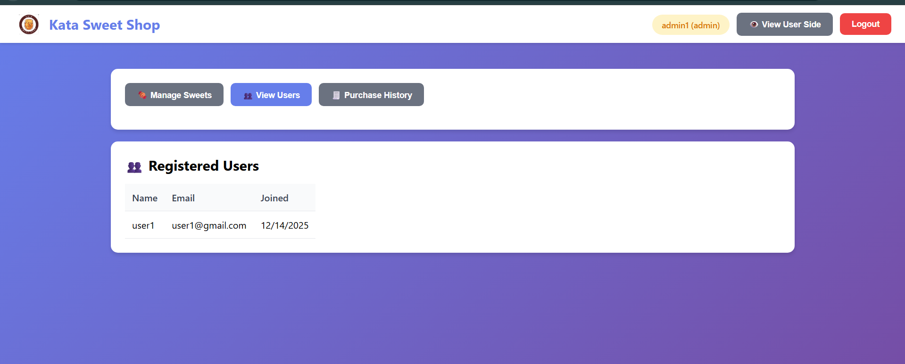
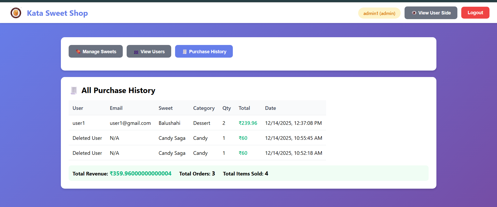
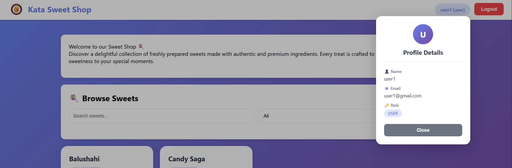
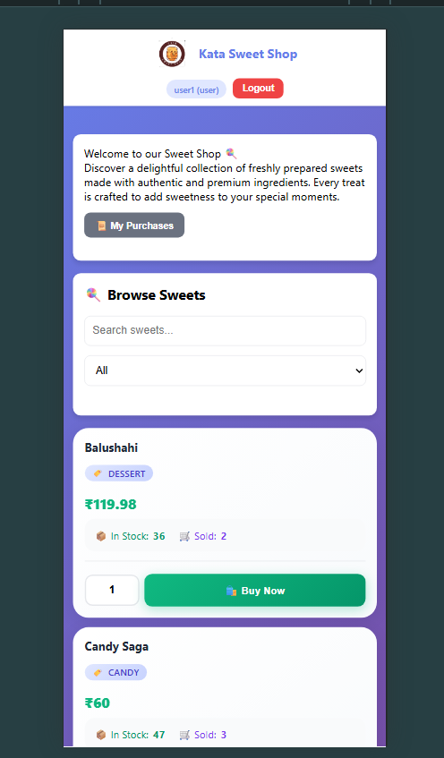

# 🍬 Sweet Shop Management System

A full-stack web application for managing a sweet shop with role-based access control. Built with React (Vite) for the frontend and Node.js/Express for the backend, with MongoDB as the database.


---

## 📋 Table of Contents

- [Project Overview](#-project-overview)
- [Features](#-features)
- [Tech Stack](#-tech-stack)
- [Project Structure](#-project-structure)
- [Setup Instructions](#-setup-instructions)
  - [Prerequisites](#prerequisites)
  - [Backend Setup](#backend-setup)
  - [Frontend Setup](#frontend-setup)
- [Environment Variables](#-environment-variables)
- [API Endpoints](#-api-endpoints)
- [Screenshots](#-screenshots)
- [My AI Usage](#-my-ai-usage)
- [Future Enhancements](#-future-enhancements)
- [License](#-license)

---

## 🎯 Project Overview

The **Sweet Shop Management System** is a comprehensive web application designed to streamline the operations of a sweet shop. It provides separate interfaces for **administrators** and **customers**, enabling efficient inventory management, sales tracking, and a seamless shopping experience.

### Key Objectives:

- **Admin Management**: Full control over inventory (add, edit, delete, restock sweets)
- **Customer Experience**: Browse and purchase sweets with a user-friendly interface
- **Purchase Tracking**: Complete history of all transactions for both users and admins
- **Role-Based Access**: Secure authentication with different permissions for admins and users

---

## ✨ Features

### 👤 User Features

- **User Registration & Login**: Secure authentication with JWT tokens
- **Browse Sweets**: View all available sweets with search and filter options
- **Purchase Sweets**: Buy sweets with quantity selection
- **Purchase History**: View personal purchase history with total spending

### 👨‍💼 Admin Features

- **Inventory Management**: Add, edit, and delete sweets
- **Custom Categories**: Create custom categories beyond predefined ones
- **Restock Items**: Easily restock low inventory items
- **View All Users**: See all registered customers
- **Purchase Analytics**: View all purchase history with revenue statistics
- **User View Mode**: Preview the customer interface in read-only mode

### 🔐 Security Features

- JWT-based authentication
- Password hashing with bcrypt
- Role-based route protection
- CORS configuration for secure API access

---

## 🛠 Tech Stack

### Frontend

| Technology       | Purpose                        |
| ---------------- | ------------------------------ |
| React 18         | UI Framework                   |
| Vite             | Build Tool & Dev Server        |
| React Router DOM | Client-side Routing            |
| Axios            | HTTP Client                    |
| React Hot Toast  | Notifications                  |
| CSS3             | Styling with Responsive Design |

### Backend

| Technology | Purpose                       |
| ---------- | ----------------------------- |
| Node.js    | Runtime Environment           |
| Express.js | Web Framework                 |
| MongoDB    | Database                      |
| Mongoose   | ODM for MongoDB               |
| JWT        | Authentication                |
| bcryptjs   | Password Hashing              |
| CORS       | Cross-Origin Resource Sharing |
| dotenv     | Environment Variables         |

---

## 📁 Project Structure

```
Incubyte/
├── backend/
│   ├── connection/
│   │   └── db.js                 # MongoDB connection
│   ├── controllers/
│   │   ├── auth.controller.js    # Authentication logic
│   │   └── sweet.controller.js   # Sweet & Purchase logic
│   ├── middleware/
│   │   └── auth.middleware.js    # JWT & Admin middleware
│   ├── model/
│   │   ├── User.model.js         # User schema
│   │   ├── Sweet.model.js        # Sweet schema
│   │   └── Purchase.model.js     # Purchase schema
│   ├── routes/
│   │   ├── auth.routes.js        # Auth routes
│   │   └── sweets.routes.js      # Sweet routes
│   ├── app.js                    # Express app entry
│   ├── jwt.js                    # JWT utilities
│   ├── package.json
│   └── .env                      # Environment variables
│
├── frontend/
│   ├── src/
│   │   ├── assets/
│   │   │   └── logo.png          # App logo
│   │   ├── components/
│   │   │   ├── Navbar.jsx        # Navigation bar
│   │   │   ├── ProtectedRoute.jsx # Route protection
│   │   │   ├── SweetCard.jsx     # Sweet display card
│   │   │   └── SweetModal.jsx    # Add/Edit sweet modal
│   │   ├── context/
│   │   │   └── AuthContext.jsx   # Authentication context
│   │   ├── pages/
│   │   │   ├── Login.jsx         # Login page
│   │   │   ├── Register.jsx      # Registration page
│   │   │   ├── Dashboard.jsx     # User dashboard
│   │   │   └── AdminDashboard.jsx # Admin dashboard
│   │   ├── services/
│   │   │   ├── api.js            # Axios configuration
│   │   │   ├── authService.js    # Auth API calls
│   │   │   └── sweetService.js   # Sweet API calls
│   │   ├── App.jsx               # Main app component
│   │   ├── main.jsx              # React entry point
│   │   └── index.css             # Global styles
│   ├── index.html
│   ├── vite.config.js
│   ├── package.json
│   ├── .env                      # Local environment
│   └── .env.production           # Production environment
│
└── README.md
```

---

## 🚀 Setup Instructions

### Prerequisites

Before you begin, ensure you have the following installed:

- **Node.js** (v16 or higher) - [Download](https://nodejs.org/)
- **MongoDB** (local or Atlas) - [Download](https://www.mongodb.com/try/download/community) or [Atlas](https://www.mongodb.com/atlas)
- **Git** - [Download](https://git-scm.com/)
- **npm** or **yarn** - Comes with Node.js

### Backend Setup

1. **Navigate to the backend directory:**

   ```bash
   cd Incubyte/backend
   ```

2. **Install dependencies:**

   ```bash
   npm install
   ```

3. **Create environment file:**
   Create a `.env` file in the backend directory:

   ```env
   PORT=3000
   MONGODB_URI=mongodb://localhost:27017/sweetshop
   JWT_SECRET=your_super_secret_jwt_key_here
   FRONTEND_URL=http://localhost:5173
   ```

   > **Note:** For MongoDB Atlas, replace `MONGODB_URI` with your connection string.

4. **Start MongoDB:**

   - **Local MongoDB:** Make sure MongoDB service is running
   - **MongoDB Atlas:** Ensure your IP is whitelisted

5. **Start the backend server:**

   ```bash
   npm start
   ```

   Or for development with auto-restart:

   ```bash
   npm run dev
   ```

6. **Verify backend is running:**
   Open [http://localhost:3000](http://localhost:3000) - You should see "Sweet Shop API is running"

### Frontend Setup

1. **Navigate to the frontend directory:**

   ```bash
   cd Incubyte/frontend
   ```

2. **Install dependencies:**

   ```bash
   npm install
   ```

3. **Create environment file:**
   Create a `.env` file in the frontend directory:

   ```env
   VITE_API_URL=http://localhost:3000/api
   ```

4. **Start the development server:**

   ```bash
   npm run dev
   ```

5. **Open the application:**
   Navigate to [http://localhost:5173](http://localhost:5173) in your browser

### Running Both Together

For convenience, you can run both servers simultaneously:

**Terminal 1 (Backend):**

```bash
cd backend && npm start
```

**Terminal 2 (Frontend):**

```bash
cd frontend && npm run dev
```

---

## 🔧 Environment Variables

### Backend (.env)

| Variable       | Description               | Example                               |
| -------------- | ------------------------- | ------------------------------------- |
| `PORT`         | Server port               | `3000`                                |
| `MONGODB_URI`  | MongoDB connection string | `mongodb://localhost:27017/sweetshop` |
| `JWT_SECRET`   | Secret key for JWT tokens | `your_secret_key`                     |
| `FRONTEND_URL` | Frontend URL for CORS     | `http://localhost:5173`               |

### Frontend (.env)

| Variable       | Description          | Example                     |
| -------------- | -------------------- | --------------------------- |
| `VITE_API_URL` | Backend API base URL | `http://localhost:3000/api` |

---

## 📡 API Endpoints

### Authentication

| Method | Endpoint             | Description       | Access |
| ------ | -------------------- | ----------------- | ------ |
| POST   | `/api/auth/register` | Register new user | Public |
| POST   | `/api/auth/login`    | Login user        | Public |

### Sweets

| Method | Endpoint                   | Description    | Access        |
| ------ | -------------------------- | -------------- | ------------- |
| GET    | `/api/sweets`              | Get all sweets | Authenticated |
| GET    | `/api/sweets/search`       | Search sweets  | Authenticated |
| POST   | `/api/sweets`              | Create sweet   | Admin         |
| PUT    | `/api/sweets/:id`          | Update sweet   | Admin         |
| DELETE | `/api/sweets/:id`          | Delete sweet   | Admin         |
| POST   | `/api/sweets/:id/purchase` | Purchase sweet | Authenticated |
| POST   | `/api/sweets/:id/restock`  | Restock sweet  | Admin         |

### Purchases & Users

| Method | Endpoint                    | Description          | Access        |
| ------ | --------------------------- | -------------------- | ------------- |
| GET    | `/api/sweets/my-purchases`  | Get user's purchases | Authenticated |
| GET    | `/api/sweets/all-purchases` | Get all purchases    | Admin         |
| GET    | `/api/sweets/allUsers`      | Get all users        | Admin         |

---

## 📸 Screenshots

### Login Page


_Beautiful login page with blurred sweet cards in the background_

### Register Page


_User registration with role selection_

### User Dashboard


_Browse and purchase sweets with search and filter functionality_

### User Purchase History


_View personal purchase history with total spending_

### Admin Dashboard - Manage Sweets


_Full inventory management with add, edit, delete, and restock options_

### Admin Dashboard - Add Sweet Modal


_Add new sweets with custom category support_

### Admin Dashboard - View Users


_View all registered customers_

### Admin Dashboard - Purchase History


_Complete purchase analytics with revenue statistics_

### Profile Popup


_User profile details popup_

### Mobile Responsive View


\*Fully responsive design for mobile devices

---

## 🤖 My AI Usage

This section describes how AI tools were utilized during the development of this project.

### Tools Used

#### 1. GitHub Copilot

**Purpose:** Code autocompletion and suggestions

**How it helped:**

- **Autocompleting repetitive code patterns**: Copilot significantly sped up writing similar structures like route handlers, controller functions, and React components.
- **Generating boilerplate code**: For creating new components, services, and API calls, Copilot provided intelligent suggestions based on the context.
- **Writing CSS styles**: Copilot helped generate responsive CSS media queries and style properties quickly.
- **Error handling patterns**: Suggested consistent try-catch blocks and error response structures.

**Example Usage:**

```javascript
// After typing the function signature, Copilot suggested the entire implementation
async function purchaseSweet(req, res) {
  // Copilot autocompleted the logic for:
  // - Finding the sweet by ID
  // - Checking quantity availability
  // - Creating purchase record
  // - Updating inventory
}
```

#### 2. ChatGPT

**Purpose:** Architecture decisions, problem-solving, and complex implementations

**How it helped:**

**a) Database Model Design:**

- Designed the MongoDB schemas for `User`, `Sweet`, and `Purchase` models
- Suggested appropriate field types, validations, and relationships
- Helped implement the reference-based relationship between purchases, users, and sweets

```javascript
// ChatGPT helped design the Purchase model with proper references
const purchaseSchema = new mongoose.Schema(
  {
    user: { type: mongoose.Schema.Types.ObjectId, ref: "User", required: true },
    sweet: {
      type: mongoose.Schema.Types.ObjectId,
      ref: "Sweet",
      required: true,
    },
    quantityPurchased: { type: Number, required: true, min: 1 },
    totalPrice: { type: Number, required: true },
  },
  { timestamps: true }
);
```

**b) Frontend Context Setup:**

- Created the `AuthContext` for managing authentication state across the application
- Implemented proper token storage and retrieval logic
- Set up protected routes with role-based access control

```jsx
// ChatGPT guided the implementation of AuthContext
export function AuthProvider({ children }) {
  const [user, setUser] = useState(null);
  // Context logic for login, register, logout
  // Token management and persistence
}
```

**c) CORS Configuration:**

- Resolved CORS issues between frontend and backend
- Configured proper origin handling for both development and production environments
- Set up environment-based URL configuration

```javascript
// ChatGPT helped configure CORS for multiple environments
const allowedOrigins = [
  "http://localhost:5173",
  "http://localhost:3000",
  process.env.FRONTEND_URL,
].filter(Boolean);
```

**d) Responsive Design:**

- Generated comprehensive media queries for all device sizes
- Suggested mobile-first approach for better UX
- Helped create the blurred background effect on auth pages

**e) Custom Category Implementation:**

- Designed the logic for handling custom categories when "Other" is selected
- Implemented dynamic category extraction from existing sweets

### AI Usage Summary Table

| Task                   | Tool Used      | Benefit                            |
| ---------------------- | -------------- | ---------------------------------- |
| Code autocompletion    | GitHub Copilot | 40% faster coding                  |
| Database schema design | ChatGPT        | Proper relationships & validations |
| Authentication flow    | ChatGPT        | Secure JWT implementation          |
| CORS configuration     | ChatGPT        | Cross-origin issues resolved       |
| Responsive CSS         | Both           | Mobile-friendly design             |
| Error handling         | GitHub Copilot | Consistent patterns                |
| Context API setup      | ChatGPT        | Clean state management             |

### Learnings from AI Usage

1. **AI as a productivity tool**: AI tools don't replace understanding; they accelerate implementation when you know what you want to build.
2. **Code review is essential**: All AI-generated code was reviewed and modified to fit the project's specific needs.
3. **Prompt engineering matters**: Clear, specific prompts yield better results from AI tools.
4. **Understanding fundamentals**: AI works best when you understand the underlying concepts and can guide it effectively.

---

## 🔮 Future Enhancements

- [ ] Payment gateway integration
- [ ] Order status tracking
- [ ] Email notifications
- [ ] Image upload for sweets
- [ ] Advanced analytics dashboard
- [ ] PWA support for mobile
- [ ] Multi-language support
- [ ] Dark mode theme

---

## 📄 License

This project is created for educational purposes as part of the Incubyte assessment.

---

## 👨‍💻 Author

**Mithanshu Hedau**

- GitHub: [@mithanshuhedau](http://github.com/mithanshuhedau)
- LinkedIn: [Mithanshu Hedau LinkedIn](https://www.linkedin.com/in/mithanshu-hedau-15066b282)

---

## 🙏 Acknowledgments

- Incubyte for the project opportunity
- GitHub Copilot for development assistance
- OpenAI ChatGPT for architectural guidance
- The open-source community for amazing tools and libraries

---

<p align="center">Made with ❤️ and lots of 🍬</p>
